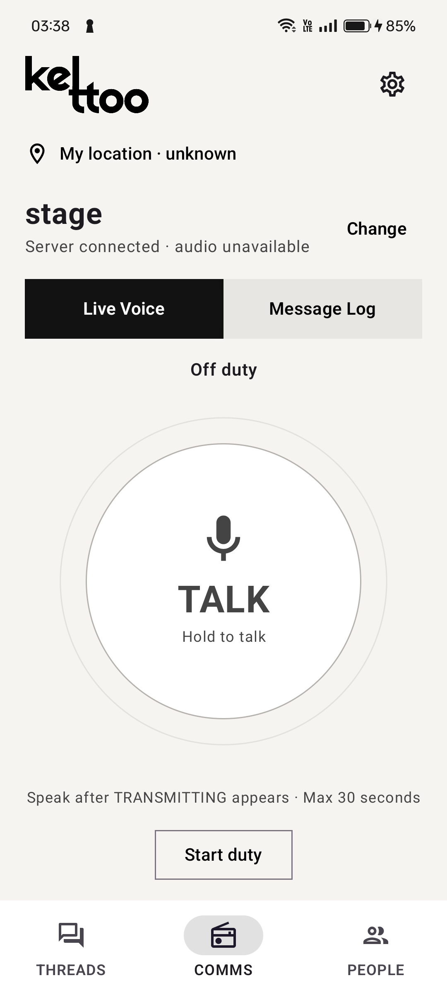
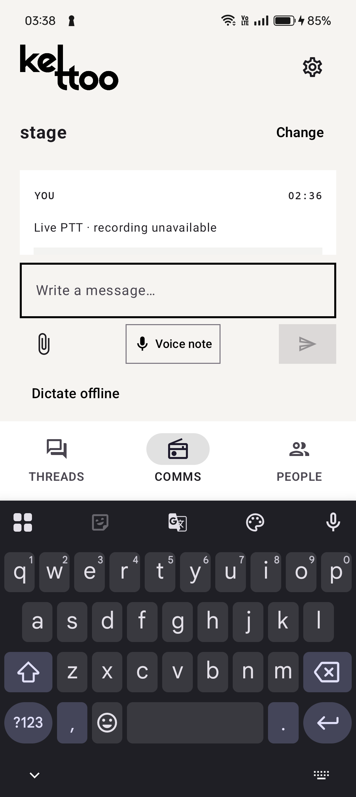
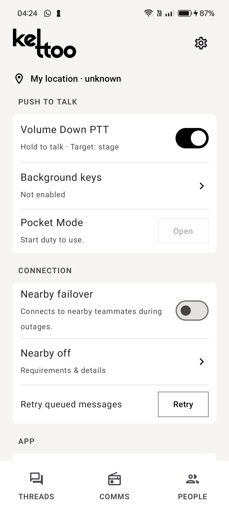
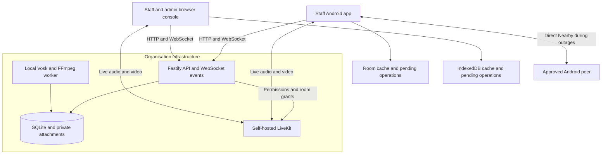

# DEFINE 4.0

Project submission for **DEFINE 4.0 — The World's Realest Hackathon**.

---

# Kettoo


## Team Information

- **Team Name**: Codio
- **Track**: PS 01

## Team Members

| Name | Role | GitHub | LinkedIn |
|------|------|--------|----------|
| Razin M | Team Lead | [@R-zin](https://github.com/R-zin) | To be added |
| Steve Sony Jacob | ML Lead | [@SteveSonyJacob](https://github.com/SteveSonyJacob) | To be added |
| Harikrishnan S | Android Developer | [@Harikrishnans1124](https://github.com/Harikrishanan1124) | To be added |
| Navaneeth Krishna B | Core Backend | [@fornkb](https://github.com/fornkb) | To be added |

---

# Project Details

## Overview

Kettoo is a private communicator that brings push-to-talk, chat, photo/video sharing and voice/video calls to staff members' phones. A native Android app and browser console connect through an organisation-hosted backend, with administrator-controlled access, channels and broadcasts. Local queues and direct Nearby communication between permitted Android phones help supported workflows continue during outages and synchronise after recovery.

## Problem Statement

Large conferences, hackathons, malls, and hospitals still rely on walkie-talkies for team coordination, which require cost, charging, and maintenance while supporting only voice communication.

Build a communicator app that runs on staff members’ phones, providing instant push-to-talk for individuals or team channels, along with chat, photo/video sharing, and voice/video calls in a familiar messaging interface.

The system must operate as a closed organisational network, where only authorised members can join and admins manage teams and channels. Provide an admin view to monitor online users and active channels, with the ability to broadcast to everyone.

Prefer direct device-to-device communication where possible, while handling network congestion, patchy connectivity, and locked phones. All messages and media must remain within the organisation’s own infrastructure.

## Solution

Kettoo combines fast voice communication with a persistent message log. Staff hold TALK on a permitted channel or private exchange, send messages and attachments, or start a private voice/video call. Saved PTT bursts remain available for replay, local English transcription and personal acknowledgement/archive.

Administrators approve staff accounts and devices, manage channel memberships, monitor presence and audio readiness, designate a duty-admin device, and broadcast to one team, selected teams or everyone. Volunteers can belong to multiple channels; private live PTT follows teammate/duty-admin permissions, while private messaging and calls have separate access rules.

The organisation hosts the API, SQLite database, attachment storage and LiveKit media service. Vosk speech recognition runs locally on Android or on the organisation's server without a cloud speech API. The clients retain pending work in Room or IndexedDB, and permitted Android phones automatically discover and authenticate direct Nearby peers during supported outages.

Additional coordination tools include floor plans, named zones, staff check-ins and issue threads with confirmed ownership, replies and resolution. These extend the communicator brief by linking reports to a place and an accountable response.

**Current scope:** Kettoo is a development/demo implementation, version **0.3.0**. Nearby is direct peer-to-peer fallback on Android, not multi-hop mesh. Upload scheduling, speaking leases and bounded transfers address specific communication conflicts, but realistic network congestion, venue-scale capacity and universal locked-phone behaviour still need acceptance testing. Pocket Mode keeps a dim screen awake for hardware PTT; it does not guarantee transmission from a truly locked phone.

---

# Demo

### Demo Video

**Google Drive demo video link:[Demo Video](https://drive.google.com/file/d/1MnvkUqDOb55uwyHQMiOQcbV1hwuGcG9E/view?usp=sharing) **

### Screenshots

Actual installed-app screenshots from the Android UI review. These captures show historical display states, including off-duty and Nearby-off states.

**Live Voice and channel communication**



**Message Log and keyboard-safe composer**



**Hardware PTT and Nearby settings**



---

# Live Project

**Hosted demo URL: To be added.**

Kettoo currently runs on the organisation's own infrastructure. After local setup, open the browser console at [http://127.0.0.1:8787](http://127.0.0.1:8787). This address works on the machine running the server; phones need a reachable, trusted organisation server/media address.

---

# Technical Implementation

## Technologies Used

| Category | Technologies |
|----------|--------------|
| **Frontend** | Native Android: Kotlin and Jetpack Compose. Browser: React, TypeScript and Vite. |
| **Backend** | Node.js 24+, Fastify, TypeScript, authenticated HTTP and WebSocket events. |
| **Database** | SQLite on the server, Room on Android, IndexedDB in the browser. |
| **APIs / Services** | Self-hosted LiveKit for live audio/video; Google Nearby Connections for direct Android communication. |
| **AI / ML** | Local Vosk English speech recognition; FFmpeg for uploaded audio processing. |
| **DevOps / Deployment** | Caddy HTTPS proxy, Docker Compose media/proxy configuration, PowerShell and Windows launch helpers. |
| **Other Tools** | Gradle, Android lint/instrumentation tests, TypeScript and Node test runner. |

## System Architecture



The server checks account/device approval, conversation membership, issue audiences and media permissions. Speaking leases serialize channel transmitters, while clients coordinate microphone ownership, call priority and receive routing. Stable message/operation IDs support retry deduplication.

Nearby peers authenticate enrolled device keys and organisation-signed credentials, verify transferred content, and synchronise completed messages after recovery. Maps, check-ins and issue operations use server queues rather than peer replication. Offline credentials expire after up to eight hours; total outages prevent immediate propagation of new revocations.

## Key Features

- **Push-to-talk:** permitted channel/private exchanges, explicit transmission state, server speaking leases, 30-second ceiling and replay.
- **Messaging and attachments:** text, photos, videos and voice notes with history, validated uploads and delivery states. Limits: images 5 MB, videos 10 MB, audio 1 MB.
- **Private calls:** voice/video ringing, acceptance, rejection, ending and busy handling. Conserve Data disables video.
- **Closed organisational access:** staff account/device approval, revocation, multiple channel memberships and server-enforced permissions.
- **Admin monitoring and broadcasts:** connected/on-duty/media-ready/busy states, last seen, duty-admin exchanges and selected/all-staff broadcasts.
- **Connectivity recovery:** durable Room/IndexedDB queues, direct Android Nearby live PTT/media and later deduplicated server synchronisation.
- **Local speech and archive:** English transcripts of saved audio, editable offline dictation on Android and personal acknowledge/archive.
- **Field controls:** optional Volume Down PTT, audio routing, background key service and Pocket Mode.
- **Venue coordination:** multiple floor plans, zones, check-ins, staffing visibility and issue reporting, claims, replies and resolution.

Historical verification includes two-phone media and Nearby outage/recovery checks. A **34/34 backend test** run and server/browser builds passed during preparation of the project summary on 10 October 2026. This is a recorded snapshot, not a claim that every subsequent change was retested. See [verification notes](./VERIFICATION.md), [Phase 2](./overview_till_phase2.md), [Phase 3](./overview_phase3.md) and [Nearby failover](./docs/nearby-failover.md) for evidence and remaining checks.

---

# Setup Instructions

## Prerequisites

- Git and access to the private project repository.
- Node.js **24 or newer** with npm.
- For Android builds: JDK **17**, Android SDK platform **35** and the included Gradle wrapper. The app supports Android API **26+**.
- For local speech setup: Python and internet access for the first model/runtime installation.
- For live voice/video: a configured LiveKit server reachable by participating clients.
- For the Docker deployment path: Docker with Compose and trusted HTTPS/DNS configuration.
- For Nearby: compatible Android phones with the required Bluetooth, Wi-Fi and microphone permissions, approved devices and valid cached credentials.

## Installation

### 1. Clone the Repository

```bash
git clone https://github.com/SteveSonyJacob/ketto_pvt.git
cd ketto_pvt
```

The repository is private, so the clone requires authorised GitHub access.

### 2. Install Dependencies and Build

```powershell
npm ci
npm run build
```

This builds the TypeScript API and browser console.

### 3. Start a Local Preview

On Windows, run:

```powershell
.\start.bat
```

The launcher installs missing dependencies, builds the app, starts the available local LiveKit service, prepares volunteer test accounts and opens the dashboard. For a fresh checkout without `.env`, it creates local settings and stores the initial admin sign-in in the ignored `data/local-admin-sign-in.txt`. Keep generated account credentials private. The test helper approves its volunteer accounts; newly registered volunteer devices still need approval.

Stop the local services with:

```powershell
.\stop.bat
```

Alternatively, start only the API and built browser app manually:

```powershell
$env:ADMIN_PASSWORD = 'choose-a-unique-password-at-least-12-characters-long'
$env:DATA_DIR = './data'
npm start
```

Open [http://127.0.0.1:8787](http://127.0.0.1:8787). On first initialisation, the administrator email defaults to `admin@kettoo.local`; set `ADMIN_EMAIL` before the first start to change it. Manual API startup does not launch LiveKit. Live voice/video needs the separate configured media service.

### 4. Configure Organisation Deployment

Copy `.env.example` to `.env`, set unique administrator and LiveKit secrets, and configure:

- `APP_ORIGIN` and trusted HTTPS for the application.
- `LIVEKIT_URL` reachable by browsers and phones, with matching server credentials.
- The media host address in `deploy/livekit.yaml`.
- Organisation DNS, certificate trust and intended network access.
- A private `DATA_DIR`, plus backups of its database, attachments and signing identity.

After configuration:

```powershell
docker compose -f deploy/compose.yaml up -d
.\deploy\start.ps1
```

The Compose configuration starts LiveKit and Caddy; the PowerShell script starts the API using `.env`. The API must already be built. Existing installations should preserve their data directory and signing key when upgrading.

### 5. Set Up Speech and Build Android

From the repository root:

```powershell
.\scripts\setup-speech.ps1
cd android
.\gradlew.bat assembleDebug lintDebug
```

The debug APK is generated at `android/app/build/outputs/apk/debug/app-debug.apk`. The setup places the Vosk English model/runtime under ignored `data/speech`, and the Android build packages the model for on-device recognition.

Install the APK, enter the reachable organisation server address, sign in and approve the device. Grant the required permissions and start duty. Select a permitted conversation, hold TALK and wait for **TRANSMITTING** before speaking. Enable Nearby on participating approved phones before demonstrating direct failover.

### 6. Development and Verification

For development, run these in separate terminals:

```powershell
npm run dev -w server
```

```powershell
npm run dev -w web
```

Run the backend suite and production builds:

```powershell
npm test
npm run build
```

Real-media, speech and physical-device acceptance checks require their services, speech model or connected phones. Venue-scale load, sustained screen-off operation, locked-screen hardware PTT, radio range and noisy-room recognition need testing on the intended deployment devices.

For the full operating reference, see [README.md](./README.md). The project uses the [MIT License](./LICENSE), with speech licensing documented in [server/speech/README.md](./server/speech/README.md).
