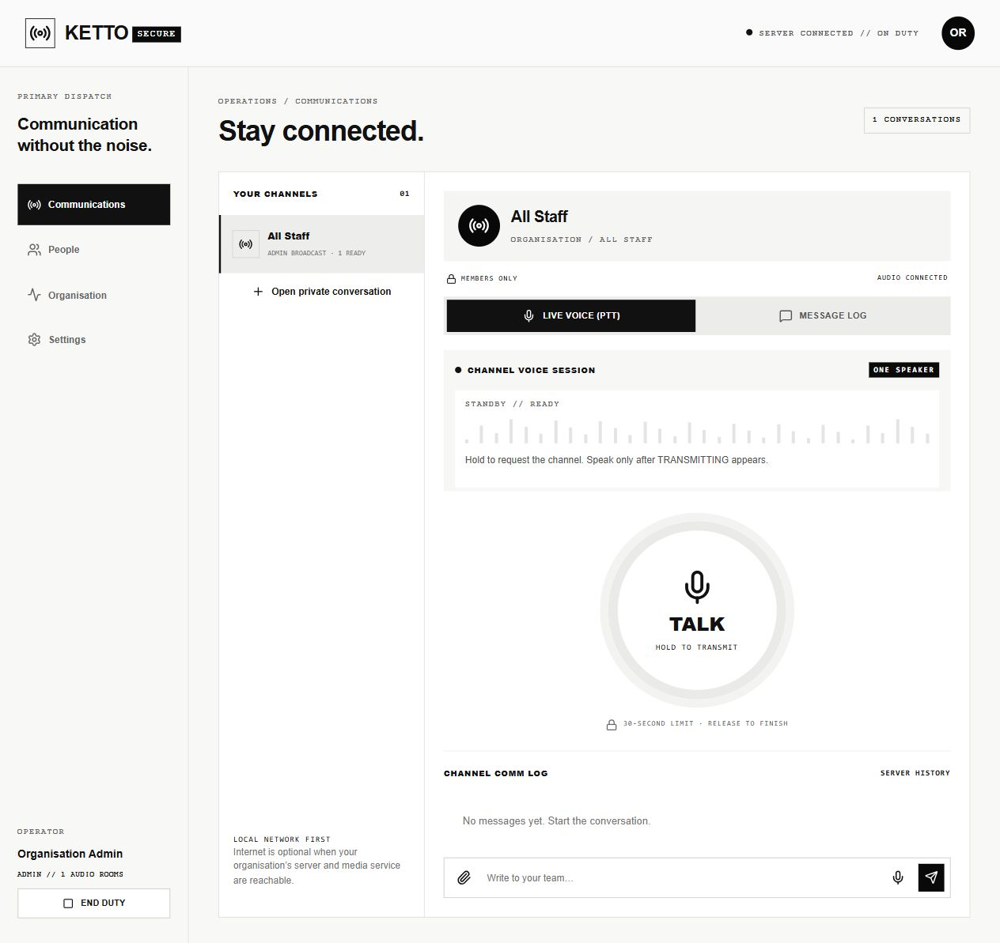

# DEFINE 4.0

Ketto — private organisation communication for event staff.

## Team Members

| Name | Role | GitHub | LinkedIn |
|------|------|--------|----------|
| Razin M | Team Lead| [@R-zin](https://github.com/R-zin) | [Profile](https://linkedin.com/in/username) |
| Steve Sony Jacob | ML lead| [@SteveSonyJacob](https://github.com/SteveSonyJacob) | [Profile](https://linkedin.com/in/username) |
| Harikrishnan S | Android Dev | [@Harikrishnans1124](https://github.com/Harikrishanan1124) | [Profile](https://linkedin.com/in/username) |
| Navaneeth Krishna B | Core Backend | [@fornkb](https://github.com/fornkb) | [Profile](https://linkedin.com/in/username) |

---

# Kettoo



Private organisation communication with a native Android staff app, a browser staff/admin console, a local TypeScript application server, SQLite, private attachments, and self-hosted LiveKit media.

The interface follows the supplied KETTO monochrome templates: square panels, bold headings, compact status labels, a large circular hold-to-talk control, and mobile bottom navigation. Product scope follows `KETTOO_SYSTEM_PLAN.md`; incident allocation and transcription remain deferred.

## Project layout

- `android/`: Kotlin / Compose app, Room cache and outbox, encrypted session vault, on-duty foreground service, shared microphone coordinator, authenticated Nearby transport, and device acceptance runner.
- `server/`: Fastify API, WebSocket presence/events, SQLite records, organisation/device approval, conversation permissions, speaking leases, call lifecycle, receipts, signed offline credentials, and attachment storage.
- `web/`: React console and staff communication UI, browser LiveKit coordination, IndexedDB outbox, uploads and replay.
- `deploy/`: local service configuration and launch scripts.

## Run the browser console

Requires Node.js 24 or later. Dependencies are pinned in `package-lock.json`.

```powershell
npm ci
npm run build
$env:ADMIN_PASSWORD = 'choose-a-unique-password-at-least-12-characters'
$env:DATA_DIR = './data'
npm start
```

Open `http://127.0.0.1:8787`. The initial admin email is `admin@kettoo.local`; `ADMIN_EMAIL` can override it at first startup. The first admin device is approved during initial bootstrap. Additional devices, and all staff accounts, require approval.

Chat and administration work with the application service alone. Audio readiness stays unavailable until LiveKit is configured and the receive room connects successfully. Never use a test password for an organisation deployment.

For local development, run `npm run dev -w server` and `npm run dev -w web` in separate terminals. The web development server proxies `/api` to the backend.

## Set up the organisation network

1. Put the host laptop and phones on one local network. Validate cross-device access and hotspot client isolation before testing voice.
2. Copy `.env.example` to `.env`, choose unique credentials, and set the API/media addresses. Run the API with `node --env-file=.env server/dist/index.js`. When the API is reached from a proxy container or other devices, its bind address must be reachable from that proxy/network.
3. Set `rtc.node_ip` in `deploy/livekit.yaml` to the host's actual LAN/hotspot address. Set the same random media secret in this file and `.env`.
4. Run LiveKit and the HTTPS proxy. `deploy/compose.yaml` pins the service images. A native Windows LiveKit executable is also suitable for a bounded demo; Linux is the recommended hosted deployment profile.
5. Make `kettoo.local` and `media.kettoo.local` resolve to the organisation host using local DNS. `deploy/Caddyfile` provides local-CA HTTPS. Clients must trust the organisation CA; browser certificate-warning bypasses and disabled verification are unsupported.
6. Permit the required demo-network ports: HTTPS TCP 443, media TCP 7881, and UDP 50000–50100. Restrict access to the intended network. The media signalling/API ports can stay behind the reverse proxy.
7. Preload dependencies, container images or binaries, and console assets before removing internet access. The communicator uses organisation services and does not require a cloud chat or speech provider.

The device-test profile supports USB endpoints `https://localhost:8443` / `wss://localhost:8444` and Wi-Fi endpoints `https://10.80.0.25:8443` / `wss://10.80.0.25:8444`. The final two-phone Wi-Fi receive check passed with USB network forwarding removed. The demo CA is scoped to those endpoints in the debug app; it does not install a root certificate into the phone's system trust store. Release builds trust system CAs. For another organisation address or CA, provide the organisation's certificate configuration deliberately, or install its CA on a debug test phone.

## Build Android

Requires a compatible JDK (17–23), Android SDK platform 35, and build tools 35.0.0. The Gradle 8.11.1 wrapper validates the distribution checksum.

```powershell
cd android
.\gradlew.bat assembleDebug lintDebug
```

The APK is generated at `app/build/outputs/apk/debug/app-debug.apk`. Grant microphone access when starting duty. Nearby requires Bluetooth/nearby-device permissions and, on older Android versions, the platform's location permissions. Camera access is requested for video calls. App-private messages, credentials and recordings are excluded from external backup.

Start duty while the app is visible. The foreground service prepares assigned receive rooms and displays an ongoing notification. Hold TALK, wait for TRANSMITTING, then speak. Release ends the burst. Speech before the ready state is not labelled delivered. Calls use the microphone exclusively; camera capture pauses when the activity leaves the foreground.

## Organisation workflow

1. Staff request access with their name, email, password and device identity.
2. The administrator approves both the account and device in **Organisation**.
3. Create teams/channels and assign explicit members. Team membership and channel membership are distinct.
4. Use **People** to open a private conversation with another approved member.
5. Approved users receive All Staff history; only admins can publish text/live broadcasts there.
6. The console distinguishes connected devices, on-duty sessions, connected audio rooms, busy devices, and last-seen time.

## Delivery and privacy boundaries

Each deployment has a persistent organisation identity from its signing key. Different organisations may use the same display name, while their media rooms remain distinct. Use separate data and keys for each organisation, including when sharing a media service.

- Each conversation is checked on history, message writes, uploads/downloads, media-token requests and call actions. The admin account has no automatic access to a staff private conversation.
- PTT requests are serialized. The media server grants microphone publishing to the winning device; a six-second renewable lease and a thirty-second ceiling stop stale transmitters. Release revokes media permission and unpublishes the live track.
- Stable message IDs deduplicate retries. Queued, server received, recipient received, and acknowledged are different states. A connected audio room is not proof that a person heard or understood speech.
- One active assigned speaker is audible even while another conversation is displayed. When channels overlap, All Staff takes precedence, then the selected active channel. Calls take exclusive audio priority.
- Replay uses the same microphone track; there is no simultaneous second PTT recorder. Failed/missing replay is displayed. The Android PCM sink path needs validation on each supported phone; it is not a transcript.
- Photos are capped at 5 MB, videos at 10 MB, and audio attachments at 1 MB. File signatures and access are checked before use. Uploads are queued during live communication. Conserve data disables video.
- Account/device revocation blocks fresh API access immediately and removes active media participants where the media service is reachable. Cached self-hosted media tokens may still reconnect during their short remaining lifetime. Strict immediate token invalidation/admission is an additional deployment requirement.
- Offline credentials expire after eight hours and bind the organisation, device key, readable conversations and publishing rights. Both peers verify signatures and a fresh proof-of-possession challenge. Nearby supports one direct peer, text and finished audio notes with hash verification, deduplication and a recipient receipt. Either phone can later synchronize a permitted signed note. Revocations and changed permissions require server contact.

## Verification

```powershell
npm test
npm run build
cd android
.\gradlew.bat lintDebug assembleDebug
```

An optional real-media test uses generated audio frames and three native clients:

```powershell
$env:LIVEKIT_URL = 'ws://127.0.0.1:7880'
$env:LIVEKIT_INTERNAL_URL = 'http://127.0.0.1:7880'
$env:LIVEKIT_API_KEY = 'your-test-key'
$env:LIVEKIT_API_SECRET = 'your-test-secret'
npm run test:media -w server
```

`android/app/src/androidTest/.../DeviceAcceptanceTest.kt` provides enrolment, receive, replay, Nearby and call checks against a test organisation. Live voice and replay use call volume; Settings shows the active output and allows speaker/headset selection. Instrumented receive checks complement an audible human check; they do not prove arbitrary manufacturer power settings or operation after force-stop.

Physical-phone helpers require a private local context file via `KETTOO_DEVICE_CONTEXT`. The call helper also reads `KETTOO_TEST_PASSWORD` from the environment. Keep these test credentials and session tokens outside the repository. Supply microphone/camera-test authorization before running capture or call phases.

See `VERIFICATION.md` for results, device/network conditions, and remaining acceptance gates. Three clients and two phones do not establish venue-wide scale or emergency-service reliability.

## Deferred features

Transcription, AI services, incidents, role allocation, escalation, GPS dispatch, multi-hop mesh, live Nearby voice, group video, lock-open microphone and emergency/DND interruption are outside this communicator build.
